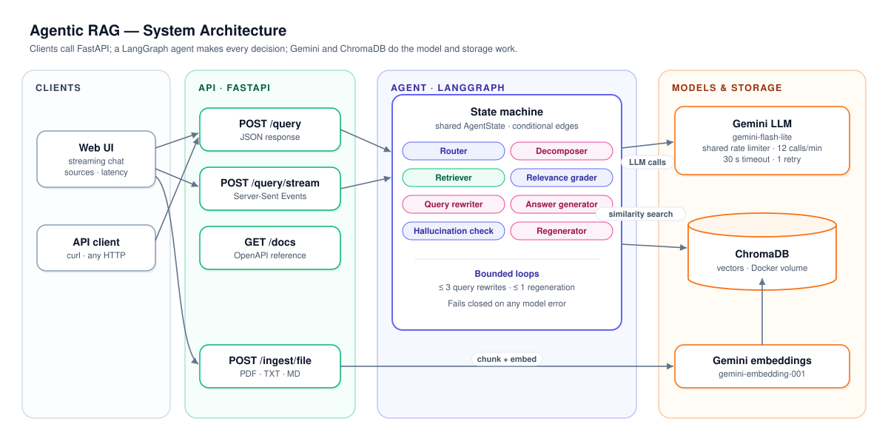
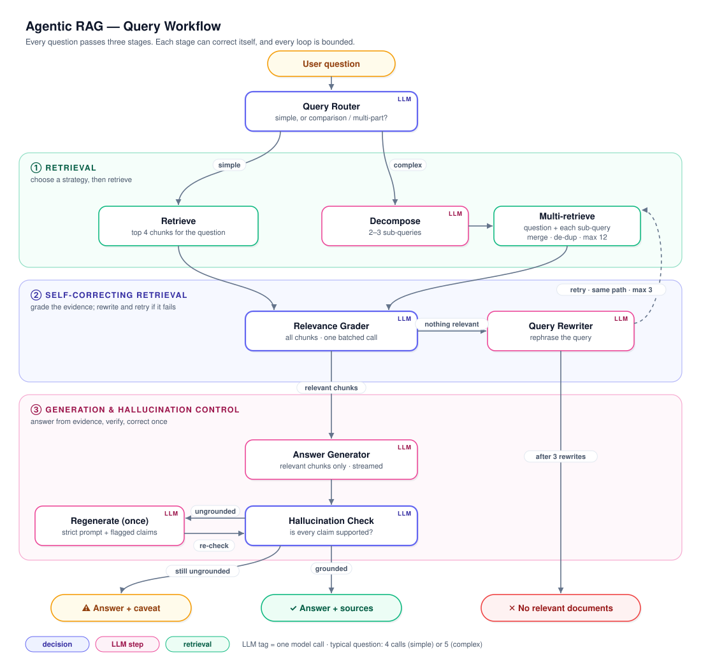

# Agentic RAG System

[](https://github.com/ShafqaatMalik/agentic_rag_system/actions/workflows/ci.yml)

**Ask questions about your own documents and get answers that are retrieved, verified and cited — or an honest "not found".**

Standard RAG retrieves once and answers whatever comes back. This system treats answering as a decision process: a LangGraph agent chooses a retrieval strategy for each question, judges whether what it found is actually relevant, rewrites the query when it isn't, and checks every claim in its answer against the sources before returning it. Answers it cannot support are regenerated or explicitly flagged, never passed off as fact.

Upload PDFs, text or Markdown through a streaming web UI or a REST API. Runs locally with one command (Docker Compose) on the Google Gemini free tier, and is backed by 208 tests and an evaluation against a 64-page technical document.

## Features

**Query Routing & Decomposition**
A router labels each question *simple* or *complex*. Only comparisons and questions with clearly separate parts count as complex. A complex question is split into 2–3 self-contained sub-queries; the original question and each sub-query are retrieved separately, then merged, de-duplicated and capped at 12 chunks, so every part of the question gets its own evidence.

**Self-Correcting Retrieval**
All retrieved chunks are graded for relevance in a single LLM call. If none are relevant, the agent rewrites the query and retrieves again, up to 3 times. If retrieval still fails, it answers "no relevant documents" instead of generating from weak context.

**Hallucination Detection & Answer Regeneration**
Every generated answer is checked claim by claim against the chunks it was based on. An ungrounded answer is regenerated once with a stricter prompt that lists the unsupported claims; if it still fails, it is returned with a visible caveat. In the UI, the corrected answer replaces the streamed draft.

**Fail-Closed Reliability**
If a grading or grounding call fails (rate limit, timeout, malformed output), the answer is never assumed relevant or grounded. The API returns an explicit error (429 with `Retry-After`, 502 or 504) and no sources, rather than an unverified answer that looks normal.

**Streaming & Observability**
Answers stream token by token over Server-Sent Events. Every response reports how it was produced: the route taken, sub-queries, rewrites, grounding verdict, whether it was revised, and latency per step.

**RAG Evaluation**
A labelled dataset of 25 questions (20 answerable, 5 not) is run against the live app and scored by a separate judge model for correctness, faithfulness and retrieval quality. Evaluation results drove two of the design changes below.

**Tested & Containerised**
208 tests (unit, integration, end-to-end) with all model calls mocked, 80% coverage, and an 8-job CI pipeline including a Docker build and a security scan.

## Architecture

<p align="center"></p>

- **Client:** a lightweight web UI that streams answers and shows sources, route, latency and caveats; any HTTP client can use the API directly.
- **API layer:** FastAPI endpoints for querying (JSON or streamed) and ingestion. Interactive reference at `/docs`.
- **Agent layer:** a LangGraph state machine that owns all decisions: routing, grading, rewriting, generating and verifying.
- **Model & storage layer:** Gemini for every LLM step behind one shared rate limiter, Gemini embeddings, and ChromaDB persisted in a Docker volume.

## Workflow

<p align="center"></p>

| Stage | Step | LLM calls |
|---|---|---|
| Routing | Router labels the question | 1 |
| ① Retrieval | *Simple:* top 4 chunks. *Complex:* decompose, then top 4 for the original question and each sub-query | 0 (simple) · 1 (complex) |
| ② Self-correcting retrieval | Grade all chunks at once; if none relevant, rewrite and retry (max 3) | 1 per attempt (+1 per rewrite) |
| ③ Generation & control | Generate, check grounding; regenerate once and re-check if needed | 2 (+2 if regenerated) |

A typical question costs **4 LLM calls** on the simple path and **5** on the complex path; the worst case is 12 and 16.

## Design Decisions

**Fail closed, not open.**
An early version defaulted to "relevant" and "grounded" whenever a check failed. Under free-tier rate limits, that meant users received apologies dressed up as cited, verified answers. Now any failed check surfaces as an explicit error, so a wrong answer can never look like a verified one.

**Batch the work to stay within limits.**
Grading chunks one at a time took 4 calls per question and made rate limiting frequent. One structured call now grades all chunks; together with generating each answer once, this cut a typical query from 8 calls to 4–5 and made latency predictable.

**Never let decomposition replace the question.**
Evaluation showed sub-queries can drop the key term (for example, losing "literal IDs" from a question about embedding weaknesses), so the right passage was never retrieved. Retrieval now always includes the original question alongside its sub-queries.

**Route only what needs routing.**
The first router sent 14 of 20 evaluation questions down the complex path, including single-fact ones, adding cost and hurting recall. A tighter prompt with examples now reserves decomposition for comparisons and multi-part questions (7 of 20).

**Bound every loop.**
At most 3 query rewrites and 1 regeneration, then a clear outcome: "no relevant documents" or an answer with a caveat. Cost and latency stay predictable, and the agent can't spin indefinitely.

**Design for the free tier.**
All LLM calls share one rate limiter (12 calls/min, under the free tier's 15), each call times out after 30 s, and a rate-limited call is retried once after the wait the server asks for. Requests queue rather than fail.

## Evaluation

**Method.** 20 questions written from the *Embeddings & Vector Stores* whitepaper (February 2025; 64 pages, 139 chunks), each with a reference answer and verbatim supporting quotes: 14 single-passage, 5 multi-passage and 1 synthesis question. Plus 5 questions the document does not answer, to test refusal. Every question runs through the live app; answers are scored by a separate, stronger model (`gemini-3.5-flash`) as judge. Evaluated commit: `9b43853`. Dataset and runner: [`evaluation/`](evaluation/).

| Metric | Result |
|---|---|
| Answer correctness (correct / partial / incorrect) | **17 / 3 / 0** of 20 |
| Faithfulness (answer claims supported by sources) | **1.00** |
| Context recall (supporting passages retrieved) | **0.98** — 18 of 19 questions fully |
| Unanswerable questions correctly refused | **5 / 5** |
| Grounding check agrees with the judge | **20 / 20** |
| Latency, single user (median) | **7 s** simple · **12 s** complex |

**Evaluation-driven improvements.** The first run exposed the over-eager router and decomposition losing key terms (see Design Decisions). After fixing both:

| | Before | After |
|---|---|---|
| Router labels (simple / complex) | 6 / 14 | 13 / 7 |
| Context recall | 0.96 | 0.98 |
| Recall on the "IDs and literal terms" question | 0.50 | 1.00 |

**Known failures**
- **Synthesis across sections.** "How do sparse and dense retrieval differ?" retrieves none of its supporting passages. The answer is spread over three sections that never compare the two directly, so no single query ranks them in the top results. Decomposition doesn't help here because each sub-query lands on neighbouring passages instead. The answer still gets the core contrast right (judged partial), but misses that dense retrieval is weak on literal terms such as IDs and that combining the two addresses this.
- **Partial answers when context is complete.** Twice, all the needed chunks were retrieved but the answer left something out: cosine similarity as a metric for higher-dimensional data, and the O(log N) runtime and small margin of error of approximate nearest-neighbour search. Retrieval was right; generation was incomplete.
- **Grounding check blind spot.** The hallucination check verifies that every stated claim is supported, not that the answer is complete. All 3 partial answers passed it, correctly, since none contained an unsupported claim: `is_grounded` means nothing was made up, not that nothing was left out.

## Quick Start

Requires Docker with Compose and a Google AI Studio API key (the free tier works).

```bash
git clone https://github.com/ShafqaatMalik/agentic_rag_system.git
cd agentic_rag_system
cp .env.example .env          # add your GOOGLE_API_KEY
docker compose up --build
```

Open **http://localhost:8000**, upload a document and ask a question. Documents persist in the `chroma_data` Docker volume; `docker compose down -v` deletes them.

## API

| Endpoint | Purpose |
|---|---|
| `POST /query` | Answer a question, as JSON |
| `POST /query/stream` | Same, as Server-Sent Events: tokens, then sources, timing and the final verdict |
| `POST /ingest/file` | Add a PDF, TXT or MD file |

```bash
curl -X POST http://localhost:8000/query \
  -H "Content-Type: application/json" \
  -d '{"query": "What do Matryoshka embeddings allow users to do?"}'
```

Besides `answer` and `sources`, every response explains how it was produced: `query_type`, `sub_queries`, `iterations` (rewrites), `is_grounded`, `revised`, `caveat` and `latency_breakdown`. Full interactive reference at **http://localhost:8000/docs**.

## Configuration

Only `GOOGLE_API_KEY` is required. Key settings:

| Variable | Default | Purpose |
|---|---|---|
| `LLM_MODEL` | `gemini-flash-lite-latest` | Model for every LLM step |
| `EMBEDDING_MODEL` | `models/gemini-embedding-001` | Embedding model |
| `RETRIEVAL_K` | `4` | Chunks retrieved per query |
| `MAX_REWRITE_ITERATIONS` | `3` | Rewrites before "no relevant documents" |
| `LLM_REQUESTS_PER_SECOND` | `0.2` | Shared rate limit: 12 calls/min (free tier allows 15) |

All settings and defaults are in [`.env.example`](.env.example).

## Testing & CI

```bash
pytest                     # 208 tests; every LLM and embedding call is mocked, no API key needed
pytest --cov=app           # 80% coverage
```

GitHub Actions runs on every push and pull request: lint (ruff, black, isort), unit, integration, end-to-end and evaluation-metric tests, coverage (minimum 60%), Docker build, and a security scan (bandit, safety).

## Project Structure

```
app/
  agents/      graph.py (LangGraph workflow) · nodes.py · state.py
  chains/      router · decomposer · grader · rewriter · generator · hallucination_checker
  retrieval/   vectorstore.py: ChromaDB ingestion and multi-query retrieval
  api/         main.py (FastAPI, SSE streaming) · schemas.py
  llm.py       Gemini client: shared rate limiter, timeouts, retry
frontend/      web UI (vanilla JS)
evaluation/    dataset and evaluation runner
tests/         unit · integration · e2e · evaluation
```

## Limitations

- **Cross-section synthesis.** Questions whose answer is scattered across a document and never stated in one place can miss retrieval (see Known failures).
- **Grounding check scope.** It verifies that stated claims are supported; it does not detect missing information, so an incomplete answer, or a wrong "the documents don't cover this", can pass.
- **Single-node storage.** One local ChromaDB in a Docker volume, with no replication or access control; suited to a single user or small team.
- **Free-tier throughput.** At the time of writing (October 2026), the Gemini free tier allows 15 LLM calls/min, so concurrent users queue. An unanswerable question takes about 38 s, because it uses all 3 rewrites before refusing.
- **Evaluation scale.** 25 questions on one document, scored by an LLM judge: strong evidence of behaviour, not a benchmark.

## Tech Stack

Python 3.11 · LangGraph · LangChain · ChromaDB · Google Gemini · FastAPI · Server-Sent Events · Docker · GitHub Actions. Versions are pinned in [`requirements.txt`](requirements.txt).

## Author

**Shafqaat Malik** · [LinkedIn](https://linkedin.com/in/shafqaatmalik)
