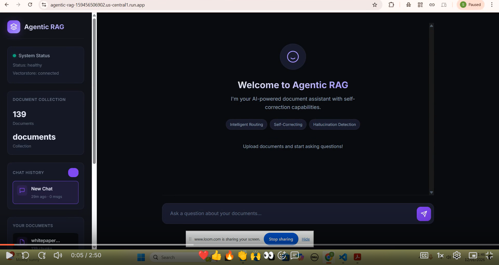
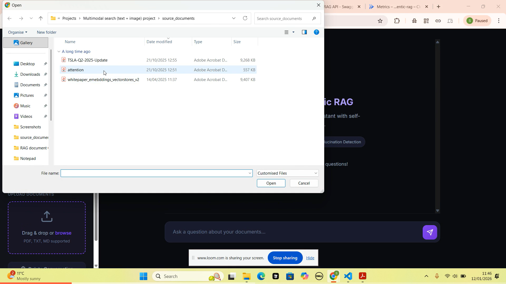
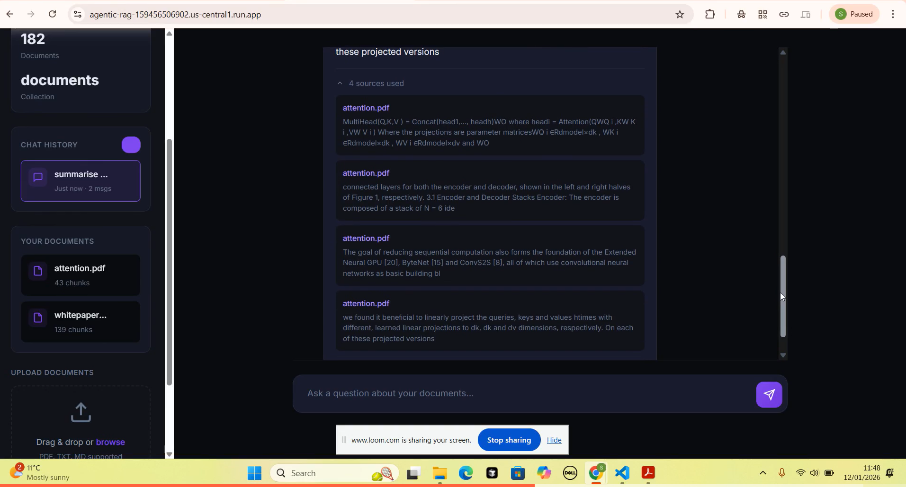
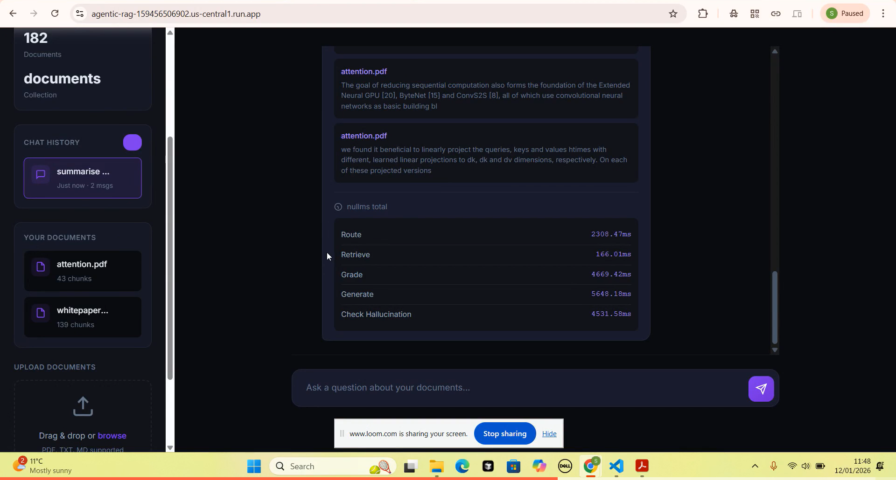

# Agentic RAG System

A production-ready Agentic RAG system that autonomously improves retrieval through multi-iteration query rewriting, flags ungrounded answers with a hallucination check, and orchestrates complex decision flows via LangGraph’s state-based architecture—going beyond traditional linear RAG pipelines. The system supports streaming responses, includes comprehensive evaluation metrics, and is fully containerized with Docker for scalable deployment.

## Features

- **Query Classification (paused)**: A router chain can classify queries as simple or complex; because both labels take the same retrieval path today, its LLM call is skipped
- **Self-Correcting Retrieval**: Grades all retrieved chunks for relevance in one LLM call and rewrites the query when needed (up to 3 attempts)
- **Hallucination Check**: Checks each answer against the retrieved context and flags ungrounded answers in the logs; it does not regenerate them
- **Streaming Responses**: Real-time response streaming via Server-Sent Events (SSE)
- **RAG Evaluation**: Built-in metrics for faithfulness, relevance, precision, and recall
- **Production Ready**: Comprehensive testing, Docker support, CI/CD pipeline, structured logging
- **Containerised**: Runs locally via Docker; containerised and Cloud Run-deployable

## Screenshots

### Welcome Screen


### Document Upload


### Successful Upload


### Query & Response


### Source Attribution


### Response Latency


### Want to Test It Yourself?

See the [Quick Start](#quick-start) section below to run it locally with Docker.

## Architecture

```
┌──────────────────────────────────┐
│   LangGraph (Flow Control)       │  ← StateGraph, conditional edges, nodes
├──────────────────────────────────┤
│   LangChain (Logic Layer)        │  ← Prompts, LLM chains, retrievers
├──────────────────────────────────┤
│   Infrastructure (DB, LLM, APIs) │  ← ChromaDB, Gemini, FastAPI
└──────────────────────────────────┘
```

## Workflow

```
START → Router (skips LLM call) → Retriever → Grader → [Decision]
                                     (one call for all chunks)
                                                         │
          ┌──────────────────────────┬───────────────────┴───────────────────┐
          ▼                          ▼                                       ▼
   (docs relevant)       (not relevant, rewrites left)       (not relevant, max rewrites reached)
          │                          │                                       │
          ▼                          ▼                                       ▼
      Generator               Query Rewriter                       No Relevant Documents
          │                          │                              (fallback message)
          ▼                          └──→ back to Retriever                  │
  Hallucination Check                     (up to 3 rewrites)                 ▼
  (flags, does not regenerate)                                              END
          │
          ▼
         END
```

The router node currently skips its LLM classification, because the simple and complex labels would both lead to the retriever; the router chain is kept for when they diverge. The grader judges all retrieved chunks in a single call. A normal query makes three LLM calls: grade, generate and the hallucination check. The hallucination check runs on the answer the user actually receives and flags answers that aren't grounded in the retrieved context (logged as `is_grounded=False`); it does not regenerate them or change the response. If the grader still finds no relevant documents after `MAX_REWRITE_ITERATIONS` rewrites, the pipeline ends with a "no relevant documents" message instead of generating an answer.

## Quick Start

The app runs locally via Docker; the image is containerised and Cloud Run-deployable.

**Prerequisites:**
- Docker Desktop (or Docker Engine with the Compose plugin)
- A Google API key for Gemini (the free tier works)

1. Clone the repository:
```bash
git clone https://github.com/ShafqaatMalik/agentic_rag_system.git
cd agentic_rag_system
```

2. Configure environment:
```bash
cp .env.example .env
# Edit .env and set GOOGLE_API_KEY
```

3. Start the app:
```bash
docker compose up --build
```

4. Ingest documents (PDF, TXT, MD), either by uploading them in the web UI, or via the API:
```bash
# A single file
curl -X POST "http://localhost:8000/ingest/file" -F "file=@document.pdf"

# Everything in ./data (mounted into the container at /app/data)
curl -X POST "http://localhost:8000/ingest/directory" \
  -H "Content-Type: application/json" \
  -d '{"directory_path": "/app/data"}'
```

5. Open [http://localhost:8000](http://localhost:8000) and start asking questions.

Ingested documents are stored in the `chroma_data` Docker volume and survive restarts. `docker compose down` keeps them; `docker compose down -v` deletes them.

**Running without Docker (development):**
```bash
python3.11 -m venv venv && source venv/bin/activate
pip install -r requirements.txt
uvicorn app.api.main:app --reload
```

### API Endpoints

| Endpoint | Method | Description |
|----------|--------|-------------|
| `/health` | GET | Health check |
| `/ingest/file` | POST | Ingest single document (PDF, TXT, MD) |
| `/ingest/directory` | POST | Ingest all documents from directory |
| `/query` | POST | Query the system |
| `/query/stream` | POST | Query with streaming response (SSE) |
| `/collection/stats` | GET | Get collection statistics |
| `/collection/documents` | GET | Get list of documents in collection |
| `/collection/document/{document_name}` | DELETE | Delete specific document |
| `/collection` | DELETE | Clear all documents |
| `/graph/visualization` | GET | Get Mermaid diagram of workflow |

### API Usage Examples

**Query the system:**
```bash
curl -X POST "http://localhost:8000/query" \
  -H "Content-Type: application/json" \
  -d '{"query": "How is AI used in healthcare?"}'
```

**Upload a document:**
```bash
curl -X POST "http://localhost:8000/ingest/file" \
  -F "file=@document.pdf"
```

**Stream response:**
```bash
curl -X POST "http://localhost:8000/query/stream" \
  -H "Content-Type: application/json" \
  -d '{"query": "Explain the revenue trends"}'
```

## Testing

The suite has 127 tests; LLM and embedding calls are mocked, so no API key is needed.

| Marker | Purpose | Run Command |
|--------|---------|-------------|
| `unit` | Component-level tests | `pytest -m unit` |
| `integration` | Chain/graph flow tests | `pytest -m integration` |
| `e2e` | Full pipeline tests | `pytest -m e2e` |
| `evaluation` | RAG metrics tests | `pytest -m evaluation` |

```bash
# Run all tests
pytest

# Run with coverage
pytest --cov=app --cov-report=html
```

## Project Structure

```
agentic_rag_system/
├── .github/workflows/ci.yml     # CI: lint, tests, coverage, Docker build, security scan
├── app/
│   ├── agents/
│   │   ├── graph.py             # LangGraph workflow definition
│   │   ├── nodes.py             # Node functions and conditional edges
│   │   └── state.py             # Agent state schema
│   ├── api/
│   │   ├── main.py              # FastAPI app, endpoints, SSE streaming
│   │   └── schemas.py           # Request/response models
│   ├── chains/
│   │   ├── generator.py         # Answer generation
│   │   ├── grader.py            # Batch document relevance grading
│   │   ├── hallucination_checker.py  # Groundedness and answer-relevance checks
│   │   ├── rewriter.py          # Query rewriting
│   │   └── router.py            # Query classification (simple/complex; currently not called)
│   ├── retrieval/
│   │   └── vectorstore.py       # ChromaDB ingestion and retrieval
│   ├── config.py                # Settings from environment variables
│   ├── errors.py                # Custom exceptions and error handling
│   ├── llm.py                   # Gemini LLM setup
│   └── logging_config.py        # structlog configuration
├── frontend/
│   ├── index.html               # Chat UI served at /
│   ├── app.js                   # Chat, upload, streaming and latency display
│   └── styles.css
├── docs/screenshots/            # README screenshots
├── data/                        # Documents to ingest (mounted at /app/data)
├── evaluation/eval_dataset.json # RAG evaluation dataset
├── tests/
│   ├── unit/                    # Chain-level tests
│   ├── integration/             # Graph flow and rewrite-loop tests
│   ├── e2e/                     # API and full-pipeline tests
│   ├── evaluation/              # RAG metrics tests
│   └── conftest.py              # Shared fixtures
├── .env.example
├── docker-compose.yml
├── Dockerfile
├── pyproject.toml               # Ruff, Black, isort, pytest, coverage config
├── pytest.ini
└── requirements.txt
```

## Configuration

| Variable | Default | Description |
|----------|---------|-------------|
| `GOOGLE_API_KEY` | Required | Google API key for Gemini |
| `LLM_MODEL` | `gemini-flash-lite-latest` | LLM model to use |
| `LLM_TEMPERATURE` | `0.0` | LLM sampling temperature |
| `EMBEDDING_MODEL` | `models/gemini-embedding-001` | Embedding model for ChromaDB |
| `COLLECTION_NAME` | `documents` | ChromaDB collection name |
| `RETRIEVAL_K` | `4` | Number of documents to retrieve |
| `MAX_REWRITE_ITERATIONS` | `3` | Max query rewrite attempts |
| `LOG_LEVEL` | `INFO` | Logging level (`DEBUG`, `INFO`, `WARNING`, `ERROR`) |

## RAG Evaluation

The system includes built-in evaluation metrics:

| Metric | Description |
|--------|-------------|
| **Faithfulness** | Is the answer grounded in the retrieved context? |
| **Answer Relevance** | Does the answer address the user's query? |
| **Context Precision** | Are the retrieved documents relevant? |
| **Context Recall** | Did we retrieve all important documents? |

## CI/CD Pipeline

The project includes a comprehensive GitHub Actions pipeline:

- ✅ Linting (Ruff, Black, isort)
- ✅ Unit Tests
- ✅ Integration Tests
- ✅ E2E Tests
- ✅ RAG Evaluation Tests
- ✅ Code Coverage
- ✅ Docker Build
- ✅ Security Scan

## Tech Stack

| Component | Technology |
|-----------|------------|
| **Orchestration** | LangGraph |
| **LLM Framework** | LangChain |
| **Vector Store** | ChromaDB |
| **LLM** | Google Gemini |
| **API** | FastAPI |
| **Testing** | pytest, ragas |
| **CI/CD** | GitHub Actions |
| **Containerization** | Docker |
